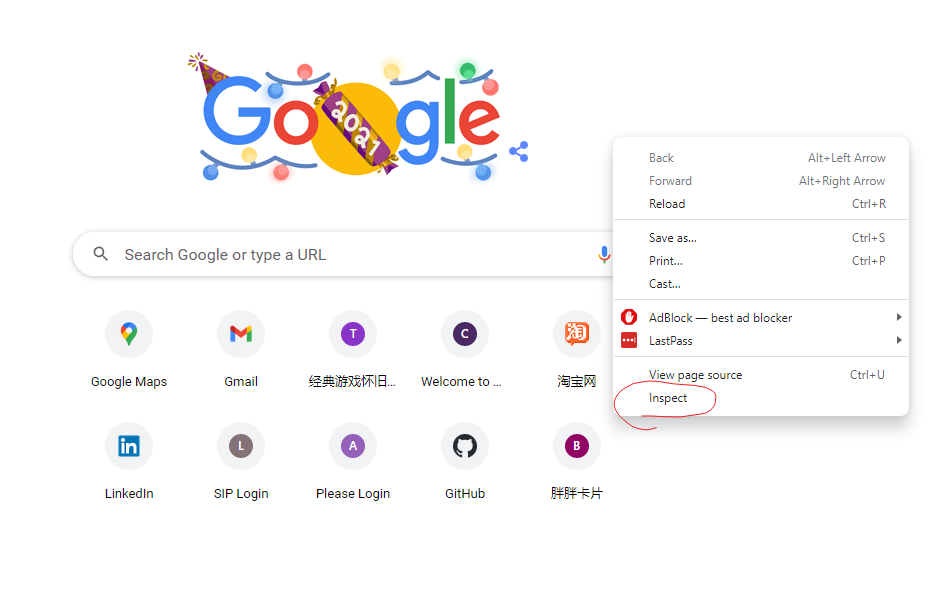
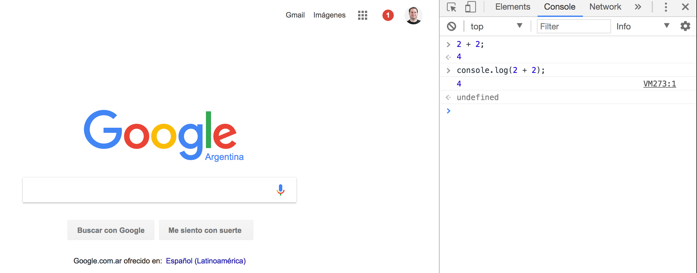

# JavaScript

[<- Home](README.md)

ℹ️Before we start we will review the "Webpage" workshop

## Definition

> JavaScript often abbreviated as JS, is a `high-level`, `interpreted` programming language. It is a language which is also characterized as `dynamic`, > `weakly typed`, `prototype-based` and `multi-paradigm`.


## JS History

- It's important to know the language's history to understand where it comes from and where it's going
- Read [auth0 - A brief history of JavaScript](https://auth0.com/blog/a-brief-history-of-javascript)
- Watch & Read [TXJS 2011 A6 – Brendan Eich – Ecma TC39: The Good, The Bad, and The Ugly.](https://brendaneich.com/2011/08/my-txjs-talk-twitter-remix)
- Watch [Tyler McGinnis - Computing Conversations with Brendan Eich](https://www.youtube.com/watch?v=IPxQ9kEaF8c)
- Watch [ECMAScript, TC39, and the History of JavaScript](https://www.youtube.com/watch?v=gytOcNFV1dM)
- Watch [How to fix the web | Brendan Eich | TEDxVienna](https://www.youtube.com/watch?v=zlcnOr81lPc)
- Watch [Brendan Eich on JavaScript at 17 - O'Reilly Fluent 2012](https://www.youtube.com/watch?v=Rj49rmc01Hs)
- Watch [ECMAScript Harmony: Rise of the Compilers - Brendan Eich keynote](https://www.youtube.com/watch?v=PlmsweSNhTw)

## JS Environments

- JavaScript now runs Client and Server side
- Using a Web Browser is one of the easiest way to execute JS Client side
- Using Node.js we can execute JS Server side
- JavaScript is no longer a scripting language to create interactive browser animations

### Client Side - Browser

- Open Chrome
- Open Devtools
- Select the console tab inside Devtools



- Write the following code and press enter to execute it:

```javascript
2 + 2;
```

```js
console.log(2 + 2);
```



- Now run the following code:

```javascript
console.log("Congrats!!!, you just ran some JS code");
```

### Node.js - Server Side 🕙

- [Node.js®](https://nodejs.org/) is a JavaScript runtime built on Chrome's V8 JavaScript engine. Node.js uses an event-driven, non-blocking I/O model that makes it lightweight and efficient. Node.js' package ecosystem, npm, is the largest ecosystem of open source libraries in the world.
- It was created by [Ryan Dahl](https://wikipedia.org/wiki/Node.js) in 2009
- We'll use Node.js from now on to learn the language and run our JavaScript exercises
- Once we know the language core concepts we'll learn about the Browsers API's
- [Download & install Node.js](https://nodejs.org/en/download/)🕙
- [Install Node.js & npm Windows](http://blog.teamtreehouse.com/install-node-js-npm-windows)


## ℹ️Alternative way: install nvm - the node versions on windows (good to know, if you have time you could uninstall node and try this way)
https://github.com/coreybutler/nvm-windows/releases/download/1.1.9/nvm-setup.zip

```bash
nvm install lts
```


- After installing Node.js open a terminal window and run the following command:

```bash
node --version
v16.13.1
```

- Also check that you have npm installed too:

```bash
npm --version
8.1.2
```


- Now that we know that we have installed Node.js & npm we can use it
- Execute the following command:

```bash
node
>
```

if it does not work for you, try this to run node in *git bash* or try to run node in vs code's terminal👌
```bash 
winpty node --version
```

- It looks like nothing happened but in reality we are executing Node.js JavaScript console
- The **>** symbol means that we opened the Node.js console and it's waiting for us to input JS code
- Now we can write JS code and execute it the same way we did using the browser
- This console is called `REPL("Read-Eval-Print-Loop")`

### Using Node.js REPL

- Open your terminal
- Execute the `node` command
- If you do not see the **>** symbol (and you are using Windows) try `winpty node` instead
- Write the following sentence once you see the **>** symbol:

```javascript
2 + 2;
```

- Press the enter key to see the following result:

```javascript
> 2+2
4
>
```

- Press CTRL + C to quit
- You'll see the following message:

```bash
(To exit, press ^C again or type .exit)
```

- So you need to press CTRL + C twice to exit
- In this exercise we added two numbers and Node.js output the result
- It's nice to be able to try code using Node.js console but for longer programs it's better to use a JS files
