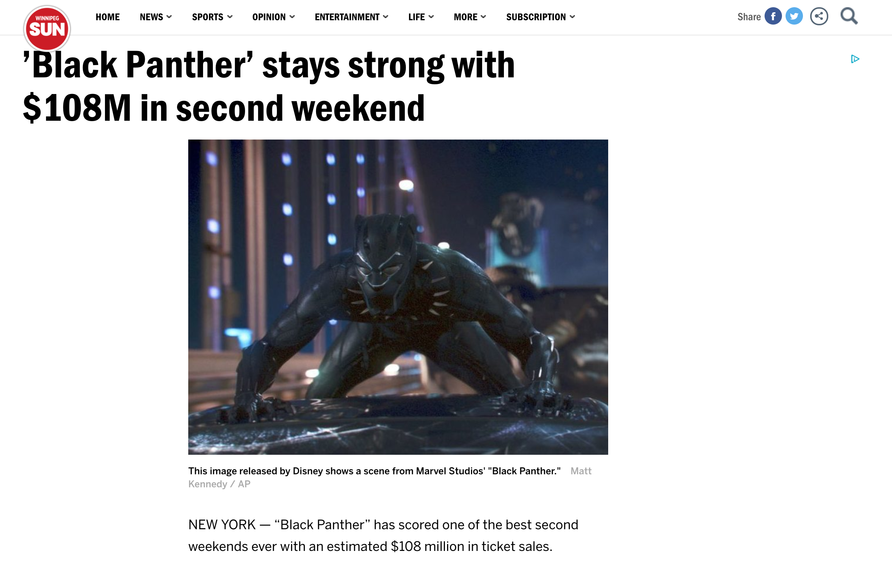
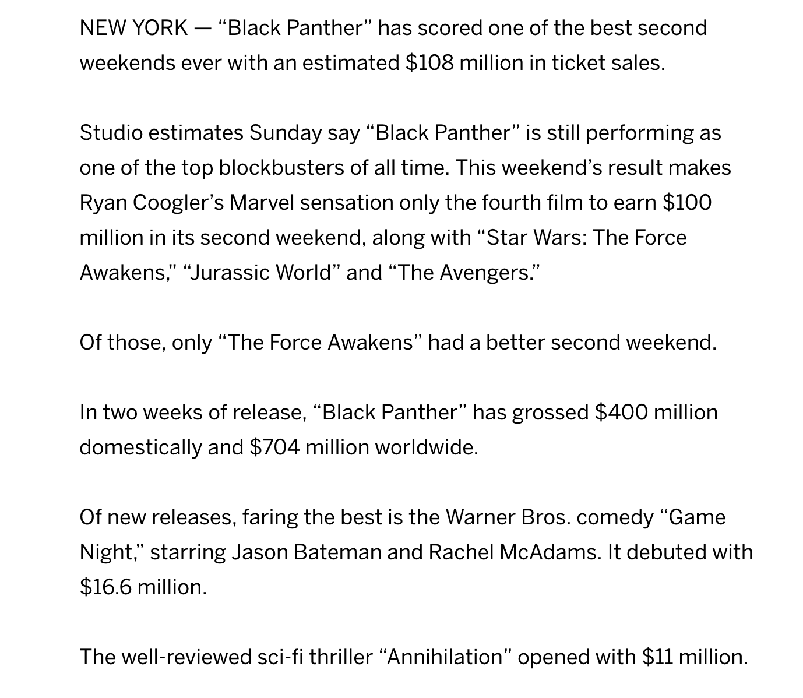
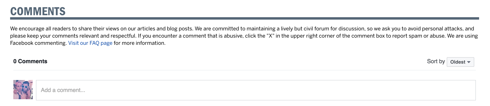
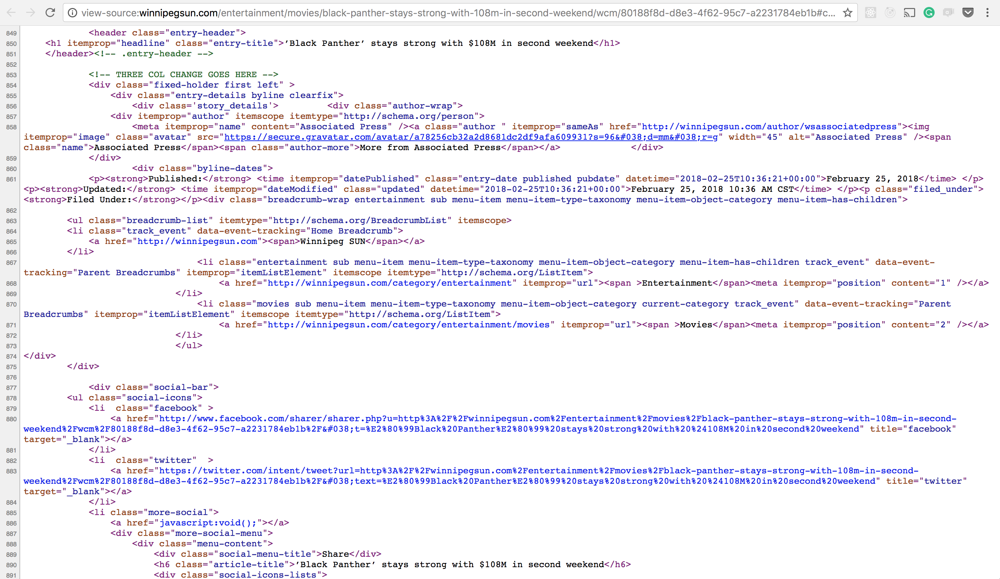

# HTML part a

[<- Home](README.md)

# HTML

[<- Home](README.md)

## What is HTML?

[Wikipedia definition:](https://en.wikipedia.org/wiki/HTML)

> `Hypertext Markup Language (HTML)` is the standard **markup language** for creating web pages and web applications.

* Web browsers receive HTML documents from a web server or from local storage and render them into multimedia web pages. 

> **HTML describes the structure of a web page**.

[Markup Language Wikipedia definition:](https://en.wikipedia.org/wiki/Markup_language)

* The current HTML version is [HTML5](https://en.wikipedia.org/wiki/HTML5)

> A markup language is a system for annotating a document in a way that is syntactically distinguishable from the text. Instructions are expressed directly by tags.

Open the [following news](http://winnipegsun.com/entertainment/movies/black-panther-stays-strong-with-108m-in-second-weekend/wcm/80188f8d-d8e3-4f62-95c7-a2231784eb1b) and define the different parts of the document structure.

Looks like this document has the following sections:

* A main title: ’Black Panther’ stays strong with $108M in second weekend
* A picture
* A picture description: This image released by Disney shows a scene from Marvel Studios' "Black Panther." Matt Kennedy / AP

* Secondary title: NEW YORK — “Black Panther” has scored one of the best second weekends ever with an estimated $108 million in ticket sales.
* Text:
Studio estimates Sunday say “Black Panther” is still performing as one of the top blockbusters of all time. This weekend’s result makes Ryan Coogler’s Marvel sensation only the fourth film to earn $100 million in its second weekend, along with “Star Wars: The Force Awakens,” “Jurassic World” and “The Avengers.”
Of those, only “The Force Awakens” had a better second weekend.
In two weeks of release, “Black Panther” has grossed $400 million domestically and $704 million worldwide.
Of new releases, faring the best is the Warner Bros. comedy “Game Night,” starring Jason Bateman and Rachel McAdams. It debuted with $16.6 million.
The well-reviewed sci-fi thriller “Annihilation” opened with $11 million.
* Comments section: 0 Comments
* Share your thoughts 
* Featured Articles title 
* Comments form 
* Finally, this is how the news HTML code looks like: 

## Tag Structure

* As HTML is a markup language we'll use tags to create HTML elements that will show the user the different document sections and content.
* A tag will have the following parts:
  * The `<` character defines the initial part of our tag
  * Then well add the `tagname` that we want to use
  * At the end we'll use the `>` character
  * We can call this void or empty element as it doesn't have any content
  ```html
  <tagname>
  ```

## Basic HTML Tags
https://www.w3schools.com/tags/ref_byfunc.asp