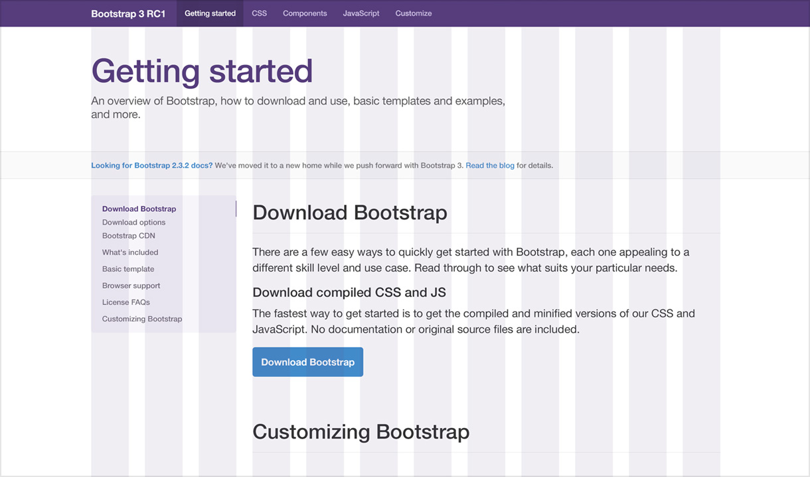
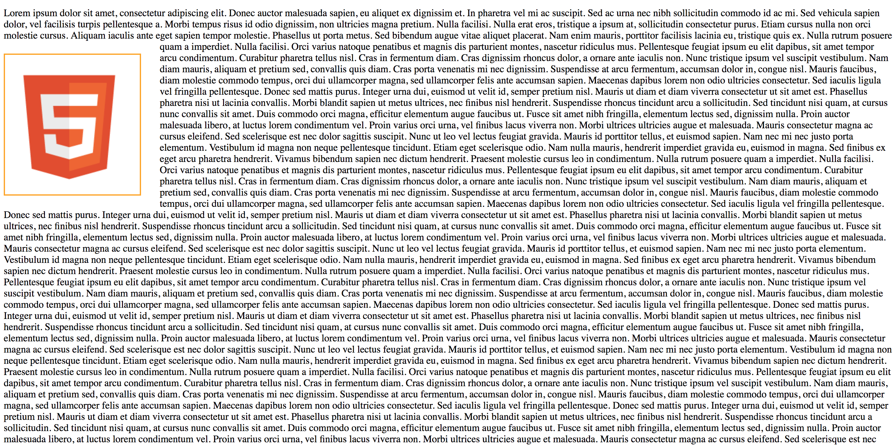

## Box Model 🕙

* We can think about HTML elements as a box
* This concept is known as CSS box model
* The CSS box model is the foundation of layout on the Web as each element is represented as a rectangular box

  

* The box model has 5 parts:
  * **Content area**
  * **Padding area:** refers to the inner margin of a CSS box — between the outer edge of the content box and the inner edge of the border
  * **Border area:** it sits between the outer edge of the padding and the inner edge of the margin
  * **Margin area:** it surrounds a CSS box, and pushes up against other CSS boxes in the layout
  * **Width & height:** this properties set the width and height of the content box, which is the area in which the content of the box is displayed
* [MDN Introduction to the CSS box model](https://developer.mozilla.org/en-US/docs/Web/CSS/CSS_Box_Model/Introduction_to_the_CSS_box_model)
* [MDN Box model](https://developer.mozilla.org/en-US/docs/Learn/CSS/Introduction_to_CSS/Box_model)
* [CSS Tricks - the-css-box-model](https://css-tricks.com/the-css-box-model)

* This properties are added to define the element real width and height value
* **Width** =	width + padding-left + padding-right + border-left + border-right
* **Height** = height + padding-top + padding-bottom + border-top + border-bottom

<details>
<summary><b>Optional: More about box model and css </b></summary>

### Border:
* The **border** property is a shorthand for setting all individual border property values in a single declaration
  * border-width
  * border-style
  * border-color
* [MDN border doc](https://developer.mozilla.org/en-US/docs/Web/CSS/border)

  **Example:**
  ```css
  div {
    border: 1px solid red;
  }
  ```

  

* We can also use individual property for each of the values:
  * border-width
  * border-style
  * border-color 

  **Example:**
  ```css
  div {
    border-width: 1px;
    border-style: solid;
    border-color: red;
  }
  ```

* Using the **border** property we set the same width, style and color for all 4 element borders
* We can set individual borders for each border using the border name: left, top, right, bottom

  **Example:**
  ```css
  div {
    border-top: 1px solid red;
    border-bottom: 2px solid green;
    border-left: 3px solid purple;
    border-right: 4px solid blue;
  }
  ```

  

### Width
* The **border-width** property is a shorthand property for setting the widths on all four sides of an element's border
* When `one value` is specified, it applies the same width to `all four sides`
* When `two values` are specified, the first width applies to the `top and bottom`, the second to the `left and right`
* When `three values` are specified, the first width applies to the `top`, the second to the `left and right`, the third to the `bottom`
* When `four values` are specified, the widths apply to the `top, right, bottom, and left` in that order **(clockwise)**
* Many CSS properties works this way
* We can also set keyword values using: **thin, medium & thick**
* [MDN border-width doc](https://developer.mozilla.org/en-US/docs/Web/CSS/border-width)

  **Example:**
  ```css
  /* All borders width are set to 2px */
  div {
    border-width: 2px;
  }

  /* Top, Bottom are set to 2px and left, right to 3px */
  p {
    border-width: 2px 3px;
  }

  /* Top is set to 2px, left &  right to 3px and finaly bottom is set to 1px */
  span {
    border-width: 2px 3px 1px;
  }

  /* top: 2px, right: 3px, bottom: 4px and left: 5px */
  a {
    border-width: 2px 3px 4px 5px;
  }
  ```

### Style
* The **border-style** property is a shorthand property that sets the line style for all four sides of an element's border
* We can set from one to four individual values like we do with the border-width property
* Property values: **none, hidden, dotted, dashed, solid, double, groove, ridge, inset, outset**
* [MDN border-style doc](https://developer.mozilla.org/en-US/docs/Web/CSS/border-style)

  **Example:**
  ```css
  /* All borders set to dotted */
  div {
    border-width: dotted;
  }
  ```

### Color
* The **border-color** property is a shorthand property for setting the colors on all four sides of an element's border

* [MDN border-color doc](https://developer.mozilla.org/en-US/docs/Web/CSS/border-color)

  **Example:**
  ```css
  div {
    border-color: blue;
  }
  ```

* Each of this property can use the border name to set the property value to each individual border:

  **Example:**
  ```css
  /* We can use the border properties shortcuts or use individual values for each property and border type */
  div {
    border: 1px solid red;

    border-top: 1px solid red;
    border-bottom: 1px solid red;
    border-left: 1px solid red;
    border-right: 1px solid red;

    border-top-width: 1px;
    border-bottom-width: 1px;
    border-left-width: 1px;
    border-right-width: 1px;

    border-top-style: solid;
    border-bottom-style: solid;
    border-left-style: solid;
    border-right-style: solid;

    border-top-color: red;
    border-bottom-color: red;
    border-left-color: red;
    border-right-color: red;
  }
  ```

### Border Radius
* The **border-radius** property lets you round the corners of an element's outer border edge
* You can specify a single radius to make circular corners, or two radii to make elliptical corners
* Property values: one, two, three, or four length or percentage values
* [MDN border-radius doc](https://developer.mozilla.org/en-US/docs/Web/CSS/border-radius)
* [Border radius generator](http://border-radius.com)

  **Example:**
  ```css
  div {
    /* Radius is set for all 4 sides */
    border-radius: 10px;
  }

  p {
    /* top-left-and-bottom-right | top-right-and-bottom-left */
    border-radius: 10px 5%;
  }

  section {
    /* top-left | top-right-and-bottom-left | bottom-right */
    border-radius: 2px 4px 2px;
  }

  a {
    /* top-left | top-right | bottom-right | bottom-left */
    border-radius: 1px 0 3px 4px;
  }

  ```

* This property is a shorthand to set the four properties: 
  * border-top-left-radius
  * border-top-right-radius
  * border-bottom-right-radius
  * border-bottom-left-radius

  **Example:**
  ```css
  div {
    border-top-left-radius: 10px;
    border-top-right-radius: 10px;
    border-bottom-right-radius: 10px;
    border-bottom-left-radius: 10px;
  }
  ```

* Now we can set the border width, style, color & radius

  **Example:**
  ```css
  div {
    border: 1px solid red;
    border-radius: 40px 50px;
  }
  ```

#### Practice
[Exercise 8](exercises/css/ex_8.md)

### Padding
* The padding property defines the innermost portion of the box model, creating space around an element's content, inside of any defined margins and/or borders
* When one value is specified, it applies the same padding to all four sides
* When two values are specified, the first padding applies to the top and bottom, the second to the left and right
* When three values are specified, the first padding applies to the top, the second to the left and right, the third to the bottom
* When four values are specified, the paddings apply to the top, right, bottom, and left in that order (clockwise)
* [MDN padding doc](https://developer.mozilla.org/en-US/docs/Web/CSS/padding)
* [CSS Tricks doc](https://css-tricks.com/almanac/properties/p/padding/)

  **Example:**
  ```css
  div {
    border: 1px solid red;
    padding: 20px;
  }
  ```

  

* It is a shorthand for setting all individual paddings at once: 
  * padding-top
  * padding-right
  * padding-bottom
  * padding-left

  **Example:**
  ```css
  div {
    border: 1px solid red;
    padding-top: 20px;
    padding-right: 20px;
    padding-bottom: 20px;
    padding-left: 20px;
  }
  ```

* We can also use the padding property to set values for each individual side:

  **Example:**
  ```css
  div {
    border: 1px solid red;

    /* top, bottom: 10px and left, right: 20px*/
    padding: 10px 20px;
    
    /* top: 10px, left, right: 20px and bottom: 30px */
    padding: 10px 20px 30px;
    
    /* top: 10px, right: 20px, bottom: 30px and left: 40px */
    padding: 10px 20px 30px 40px;
  }
  ```

### Margin
* The margin property defines the outermost portion of the box model, creating space around an element, outside of any defined borders
* Property values: same as padding
* [MDN margin doc](https://developer.mozilla.org/en-US/docs/Web/CSS/margin)

  **Example:**
  ```css
  body {
    padding: 0;
    margin: 0;
    border: 2px solid purple;
  }

  div {
    border: 1px solid red;
    margin: 0px;
  }
  ```

  

  **Example:**
  ```css
  div {
    border: 1px solid red;
    margin: 10px;
  }
  ```

  

* It is a shorthand for setting all individual margins at once: 
  * margin-top
  * margin-right
  * margin-bottom
  * margin-left


  **Example:**
  ```css
  div {
    border: 1px solid red;
    margin-top: 10px;
    margin-right: 10px;
    margin-bottom: 10px;
    margin-left: 10px;
  }
  ```

### Width & Height
* The **width** property specifies the width of an element
  * By default, the property defines the width of the content area
* The **height** property specifies the height of an element
  * By default, the property defines the height of the content area
* [MDN width doc](https://developer.mozilla.org/en-US/docs/Web/CSS/width)
* [MDN height doc](https://developer.mozilla.org/en-US/docs/Web/CSS/height)

  **Example:**
  ```css
  div {
    width: 200px;
    height: 200px;
  }
  ```

* The **min-width** property sets the minimum width of an element
  * It prevents the used value of the width property from becoming smaller than the value specified for min-width
* The **min-height** property sets the minimum height of an element
  * It prevents the used value of the height property from becoming smaller than the value specified for min-height.
* [MDN min-width doc](https://developer.mozilla.org/en-US/docs/Web/CSS/min-width)
* [MDN min-height doc](https://developer.mozilla.org/en-US/docs/Web/CSS/min-height)

  **Example:**
  ```css
  div {
    min-height: 100px;
    min-width: 100px;
  }
  ```

* The max-width CSS property sets the maximum width of an element
  * It prevents the used value of the width property from becoming larger than the value specified by max-width
* The max-height CSS property sets the maximum height of an element
  * It prevents the used value of the height property from becoming larger than the value specified for max-height
* [MDN max-width doc](https://developer.mozilla.org/en-US/docs/Web/CSS/max-width)
* [MDN max-height doc](https://developer.mozilla.org/en-US/docs/Web/CSS/max-height)

  **Example:**
  ```css
  div {
    max-height: 300px;
    max-width: 300px;
  }
  ```

### Center element using auto margin
* We can set the margin value to **auto**
* By setting left and right margins to auto we can center align a element
* Also we need to use the width property
* We can only center elements horizontaly using this technic 
* Use margin auto with `block` elements only
* To center an inline element we can always use **text-align:center**

  **Example:**
  ```css
  div {
    width: 500px;
    /* We set the top, bottom margin to 0 and left, right to be auto */
    margin: 0 auto;
  }
  ```

#### Practice
[Exercise 9](exercises/css/ex_9.md)

### Background color
* The **background-color** property sets the background color of an element
* This property is specified as a single **color** value
* [MDN background-color doc](https://developer.mozilla.org/en-US/docs/Web/CSS/background-color)

  **Example:**
  ```css
  div {
    background-color: #eee;
  }
  ```

* Also we can se the background color to be **transparent**
* This is the value by default

  **Example:**
  ```css
  div {
    background-color: transparent;
  }
  ```

### Content overflow (Optional)
* The **overflow** property specifies what to do when an element's content is too large to fit in its block formatting context
* It is a shorthand for the **overflow-x** and **overflow-y** properties
* Property values: **auto**, **hidden** & **scroll**
* [MDN overflow doc](https://developer.mozilla.org/en-US/docs/Web/CSS/overflow)

  **Example:**
  ```css
  div {
    /* x and y axis */
    overflow: scroll;

    /* Only y axis */
    overflow-y: scroll;

    /* Only y axis */
    overflow-x: scroll;
  }
  ```

### Box Shadow
* The **box-shadow** property is used to add shadow effects around an element's frame
* You can specify multiple effects separated by commas if you wish to do so
* A box shadow is described by `X and Y offsets` relative to the element, blur and spread radii, and color
* [MDN box-shadow doc](https://developer.mozilla.org/en-US/docs/Web/CSS/box-shadow)
* [Box shadow CSS Generator](https://cssgenerator.org/box-shadow-css-generator.html)

  **Example:**
  ```css
  div {
    box-shadow: 2px 3px 170px -8px rgba(0,0,0,0.8);
  }
  ```

* The first value is the `horizontal shadow length` (2px)
* Second value is the `vertical shadow length` (3px)
* Third value is the `blur radius` (170px)
* Fourth value is the `spread radius` (-8px)
* And the last value is the `shadow color`
* In this example we use the rgba function that allows us to use a rgb color + alpha channel (value from 0 to 1) to set the `shadow color ppacity` (0.8)

  **Example:**
  ```css
  div {
    box-shadow: 2px 3px 170px -8px rgba(0,0,0,0.8);
  }
  ```

* With this property we can also use the value **inset** to have an inner shadow

  **Example:**
  ```css
  div {
    box-shadow: 2px 3px 170px -8px rgba(0,0,0,0.8) inset;
  }
  ```

#### Practice
[Exercise 10](exercises/css/ex_10.md)
 
### Display (Optional)
* Every element on a web page is a rectangular box
* The **display** property in CSS determines just how that rectangular box behaves
* In HTML, default display property values are taken from behaviors described in the HTML specifications or from the browser/user default stylesheet
* Property Values:
  * **inline** 
  * **block** 
  * **inline-block** 
  * **none** 
  * **table**
* New values:
  * **flex**
  * **grid**
* [MDN display doc](https://developer.mozilla.org/en-US/docs/Web/CSS/display)
* [CSS tricks - display property](https://css-tricks.com/almanac/properties/d/display/)
* [Inline vs Block elements & inline-block](https://medium.com/@DaphneWatson/css-display-properties-block-inline-and-inline-block-how-to-tell-the-difference-7d3a1e6e3051)
* [Difference block inline CSS](https://www.impressivewebs.com/difference-block-inline-css/)

  ```css
  div {
    display: inline;
  }

  span {
    display: block;
  }

  .remove {
    display: none;
  }
  ```

* The value **none** lets you turn off the display of an element
* When you use none, all descendant elements also have their display turned off
* The document is rendered as though the element doesn't exist in the document tree

#### Practice
[Exercise 11](exercises/css/ex_11.md)

[Exercise 12](exercises/css/ex_12.md)


### Visibility
* The **visibility** property can show or hide an element without affecting the layout of a document
* Property values: **visible & hidden**

  ```css
  /* Hide all links */
  a {
    visibility: hidden;
  }

  /* Show all paragraphs */
  p {
    visibility: visible;
  }
  ```

* Both `display:none` and `visibility:hidden` they look like they work in the same way but they have a difference:
  * **display none:** will remove the element
  * **visibility hidden:** will hide the element but it will still show the empty space for that element
* [display-none vs visibility-hidden](https://www.lifewire.com/display-none-vs-visibility-hidden-3466884)

[Exercise 13](exercises/css/ex_13.md)

### Background Image
* The **background-image** property sets one or more background images on an element
* To set the image url we use the **url(image URL or path)**
* [MDN background-image doc](https://developer.mozilla.org/en-US/docs/Web/CSS/background-image)

  **Example:**
  ```css
  div {
    background-image: url(/path/to/the/image.png);
  }
  ```

* Also we can use multiple images comma separeted 

  **Example:**
  ```css
  div {
    background-image: url(/path/to/the/image.png), url(/path/to/the/image2.png);
  }
  ```

### Background Repeat (Optional)
* The **background-repeat** property defines how background images are repeated
* A background image can be repeated along the horizontal axis, the vertical axis, both axes, or not repeated at all
* Property values: **repeat-x, repeat-y, repeat, no-repeat**
* Remember to use optimized size and compression images
* [MDN background-repeat doc](https://developer.mozilla.org/en-US/docs/Web/CSS/background-repeat)

  **Example:**
  ```css
  div {
    background-image: url(/path/to/the/image.png);

    /* Only use the image once */
    background-repeat: no-repeat;

    /* Only repeat the image using the x axis */
    background-repeat: repeat-x;

    /* Only repeat the image using the y axis */
    background-repeat: repeat-x;

    /* Repeat both x & y axix */
    background-repeat: repeat;
  }
  ```

### Background Position (Optional)
* The **background-position** property sets the initial position, relative to the background position layer defined by background-origin, for each defined background image
* By default the image position is the top left corner
* Property values:
  * The first value is for the x axis:
    * Length value: %, px, em
    * left
    * center
    * right
  * Second value is for the y axis:
    * Length value: %, px, em
    * top
    * center
    * bottom 
* [MDN background-position doc](https://developer.mozilla.org/en-US/docs/Web/CSS/background-position)

  **Example:**  
  ```css
    /* This background it's going to be 10px from left to right and 20px from top to bottom */
    div {
      background-position: 10px 20px;
    }

    /* The background image is going to be centered over the x axis and at the bottom of the element */
    section {
      background-position: center bottom;
    }
  ```

* We can use different values combination:
  * left top
  * left center
  * left bottom
  * center top
  * center center
  * center bottom
  * right top
  * right center
  * right bottom

### Background Attachment (Optional)
* The **background-attachment** property determines whether that image's position is fixed within the viewport, or scrolls along with its containing block
* Property values: **fixed, scroll & local**
* [MDN background-attachment](https://developer.mozilla.org/en-US/docs/Web/CSS/background-attachment)
* [Code it down - Background attachment Demo](https://codeitdown.com/css/background-attachment)
* [CSS Tricks - background-attachment](https://css-tricks.com/almanac/properties/b/background-attachment)

  **Example:**
  ```css
  div {
    background-image: url(background.png);
    background-attachment: fixed;
  }

  div.scroll {
    background-image: url(background.png);
    background-attachment: scroll;
  }
  ```

### Background
* The **background** property lets you adjust all background style options at once, including color, image, origin and size, repeat method, and other features:
  * background-color
  * background-image
  * background-repeat
  * background-attachment
  * background-position
* [MDN background doc](https://developer.mozilla.org/en-US/docs/Web/CSS/background)


  **Example:**
  ```css
  div {
    background: red url(background.png) no-repeat fixed center center;
  }
  ```

* [CSS Tricks - Perfect full page background image tutorial](https://css-tricks.com/perfect-full-page-background-image)

### Linear Gradient (Optional)
* The **linear-gradient()** is a CSS function
* This function creates an image consisting of a progressive transition between two or more colors along a straight line
* Its result is an object of the gradient data type, which is a special kind of image.
* Property values: **Angle first-color second-color**
* [MDN linear-gradient doc](https://developer.mozilla.org/en-US/docs/Web/CSS/linear-gradient)
* [MDN Using CSS gradients guide](https://developer.mozilla.org/en-US/docs/Web/CSS/CSS_Images/Using_CSS_gradients)
* [Do you really understand CSS linear-gradients](https://medium.com/@patrickbrosset/do-you-really-understand-css-linear-gradients-631d9a895caf)

  **Example:**
  ```css
  div {
    background: linear-gradient(60deg, blue, green);
  }
  ```

#### Practice
[Exercise 14](exercises/css/ex_14.md)

[Exercise 15](exercises/css/ex_15.md)

## Cursor
* The **cursor** property specifies which mouse cursor to display when the mouse pointer is over an element
* Property values: **auto, crosshair, default, pointer, move, text, wait, help**
* We can change the **cursos** value to give more information about what the user can do
* [MDN cursor doc](https://developer.mozilla.org/en-US/docs/Web/CSS/cursor)

  **Example:**
  ```css
  body { cursor: pointer; }
  button { cursor: help; }
  ```

## Lists 🕙

### Style type
* The **list-style-type** property specifies the appearance of a list item element
* Property values for unordered lists:
  * none
  * disc
  * circle
  * square
* Property values for ordered lists:
  * decimal
  * decimal-leading-zero
  * lower-alpha
  * upper-alpha
  * lower-roman
  * upper-roman
* [MDN list-style-type doc](https://developer.mozilla.org/en-US/docs/Web/CSS/list-style-type)

  **Example:**
  ```css
  ul {
    list-style-type: none;
  }

  ol {
    list-style-type: decimal-leading-zero;
  }
  ```

### Position
* The **list-style-position** property specifies the position of the ::marker relative to a list item
* Property values: **outside & inside**
* [MDN list-style-position doc](https://developer.mozilla.org/en-US/docs/Web/CSS/list-style-position)

  **Example:**
  ```css
  ul {
    list-style-position: inside;
  }

  ol {
    list-style-position: inside;
  }
  ```

### Images
* The **list-style-image** property specifies an image to be used as the list item marker
* Use the **url()** function to set the image path/url
* [MDN list-style-image doc](https://developer.mozilla.org/en-US/docs/Web/CSS/list-style-image)

  **Example:**
  ```css
  ul {
    list-style-image: url("cat-icon.png");
  }
  ```

### List Style
* The list-style CSS property is a shorthand for setting the individual values that define how a list is displayed: 
  * list-style-type, list-style-image, and list-style-position
  * We don't have to use all values together
* [MDN list-style doc](https://developer.mozilla.org/en-US/docs/Web/CSS/list-style)

  **Example:**
  ```css
  ul {
    list-style: square inside;
  }
  ol {
    list-style: upper-roman outside;
  }
  ```

#### Practice
[Exercise 16](exercises/css/ex_16.md)


## Tables 🕙
* For tables we can use many CSS properties like border, width, padding, height, background-color, margin, etc
* Tables have some special properties like **border-spacing** & **border-collapse**

### Border Spacing
* The **border-spacing** property specifies the distance between the borders of adjacent table cells
* This property applies only when border-collapse is separate
* We can use the same value for all sides
* [MDN border-spacing doc](https://developer.mozilla.org/en-US/docs/Web/CSS/border-spacing)

  **Example:**
  ```css
  table {
    border-spacing: 10px;
  }
  ```

* If we use 2 values we set the horizontal and vertical spacing

  **Example:**
  ```css
  table {
    border-spacing: 10px 20px;
  }
  ```

### Border Collapse
* The border-collapse CSS property specifies whether cells inside a table have shared or separate borders
* Property values: **collapse & separate**
* [MDN border-collapse doc](https://developer.mozilla.org/en-US/docs/Web/CSS/border-collapse)

  **Example:**
  ```css
  table {
    border-collapse: collapse;
  }
  ```

#### Practice
[Exercise 17](exercises/css/ex_17.md)

## Forms
* We can use the CSS properties that we learned to styles our forms

  **Example:**
  ```css
  input[type="text"] {
    border: 1px solid #ddd;
    background-color: white;
    color: gray;
    font-size: 16px;
  }

  input.error {
    color: red;
    border-color: red;
  }

  input.success {
    color: green;
    border-color: green;
  }

  input[type="submit"] {
    display: block;
    border: 2px solid black;
    margin: 20px;
    color: black;
    padding: 20px;
    font-weight: bold;
    border-radius: 10px;
  }

  input[type="submit"]:hover {
    background-color: #ddd;
    cursor: pointer;
  }
  ```
  ```html
  <body>
    <form action="#">
      <input type="text" name="name">
      <input class="error" type="text" name="name">
      <input class="success" type="text" name="name">
      <input type="submit" value="Send Request">
    </form>
  </body>
  ```

#### Practice
[Exercise 18](exercises/css/ex_18.md)

[Exercise 19](exercises/css/ex_19.md)

## Layout (Optional)

* We can think about our web layout the same way designers design editorial layouts

  

* Using a grid system with rows and columns we can create flexible layouts
* This creates a better web design experience
* Using CSS properties we can create a grid library
* Some time ago we used to design [sites 960px wide](https://960.gs)
* Using this grid system we have 12 columns

  

* If the row should be 960px wide then we can create 1 column and set the value to 12
* In case we need 2 columns then each column can be 6 columns big
* For 3 columns then each column will use 4 columns space
* So we can think of our web design as rows and columns
* Now in modern days we need these grids to be responsive as we need to support different screen resolutions
* The number of columns may change depending the grid we use
* Some examples of grid systems:
  * [Unsemantic](https://unsemantic.com)
  * [Bootstrap](https://getbootstrap.com/docs/4.0/layout/grid)
  * [Foundation](https://foundation.zurb.com/grid.html)

  

### Position (Optional)
* The **position** property specifies how an element is positioned in a document
* Property values:
  * static
  * relative
  * absolute
  * fixed
  * sticky
* We'll use the **top, right, bottom, and left** properties to determine the final location of positioned element
* [MDN position doc](https://developer.mozilla.org/es/docs/Web/CSS/position)

#### Static
* This is the default value
* The element is positioned according to the normal flow of the document
* The top, right, bottom, left, and z-index properties have no effect

  **Example:**
  ```css
  div {
    position: static;
  }
  ```

#### Relative
* The element is positioned according to the normal flow of the document
* Then offset relative to itself based on the values of `top, right, bottom, and left`
* The offset does not affect the position of any other elements
* The space given for the element in the page layout is the same as if position were static
* This value creates a new stacking context when the value of z-index is not auto

  **Example:**
  ```css
  div {
    position: relative;
    top: 0;
    left: 0;
  }
  ```

  **Example:**
  ```css
  div {
    border: 1px solid black;
    background-color: #eee;
  }

  div.relative {
    position: relative;
    top: 20px;
    left: 20px;
    background-color: pink;
    border-color: red;
  }
  ```

  

* [Position Relative example](./examples/css/layout/relative.html)

#### Practice
[Exercise 20](exercises/css/ex_20.md)

#### Absolute
* The element is removed from the normal document flow
* No space is created for the element in the page layout
* It is positioned relative to its closest positioned ancestor (if any), otherwise it is placed relative to the initial containing block
* It's final position is determined by the values of `top, right, bottom, and left`
* Absolutely positioned boxes can have margins, and they do not collapse with any other margins

  **Example:**
  ```css
    body {
      border: 2px solid orange;
    }
    div {
      border: 1px solid black;
      background-color: #eee;
    }

    div.absolute {
      position: absolute;
      top: 20px;
      left: 20px;
      background-color: pink;
      border-color: red;
    }
  ```

  

* [Position Absolute example](./examples/css/layout/absolute.html)

* In the previous example the absolute position is based on the body position as it's the parent element

  **Example:**
  ```css
  body {
    border: 2px solid orange;
  }

  div {
    border: 1px solid black;
    background-color: #eee;
  }

  div.container {
    position: relative;
    height: 150px;
    background-color: green;
  }

  div.container .absolute {
    position: absolute;
    bottom: 0;
    right: 0;
    left: 50px;
    background-color: pink;
    border-color: red;
  }
  ```

  
* [Position Absolute using container example](./examples/css/layout/absolute2.html)

* Now that we added a parent container the absolute element will get the initial position from the container element instead of the body
* In some way we can say that using absolute position in this way is like creating a relative position between the parent and child element
* To be able to create this type of layout we need to remember that the parent element must have a `position:relative` position

  **Example:**
  ```css
  body {
    position: relative;
    border: 2px solid orange;
    height: 400px;
    padding: 0;
    margin: 0;
    font-size: 40px;
  }

  div.absolute {
    position: absolute;
    border: 1px solid black;
    padding: 80px;
  }

  div.first {
    background-color: red;
    top: 20px;
    left: 20px;
    z-index: 1;
  }

  div.second {
    background-color: green;
    top: 60px;
    left: 60px;
    z-index: 2;
  }
  ```
  ```html
    <body>
      <div class="absolute first">First Div.</div>
      <div class="absolute second">Second Div</div>
    </body>
  ```

  

* In this case we can use the **z-index** property to change the way elements will overlap
* Position value: a number
* Lower numbers are overlap]ped by higher ones
* [MDN z-index doc](https://developer.mozilla.org/en-US/docs/Web/CSS/z-index)

  **Example:**
  ```css
  div.first {
    z-index: 2;
  }

  div.second {
    background-color: green;
    top: 60px;
    left: 60px;
    z-index: 1;
  }
  ```

  

* [Position Absolute z-index example](./examples/css/layout/absolute3.html)

#### Practice
[Exercise 21](exercises/css/ex_21.md)

#### Fixed
* The element is removed from the normal document flow
* No space is created for the element in the page layout
* It is positioned relative to the screen's viewport and doesn't move when scrolled
* Its final position is determined by the values of `top, right, bottom, and left`

  **Example:**
  ```css
  div {
    position: fixed;
    top: 0;
    left: 0;
  }
  ```

  **Example:**
  ```css
  body {
    margin: 0;
    padding: 0 50px 0 250px; 
    background: linear-gradient(180deg, #ddd, #111);
    
  }

  div {
    text-align: justify;  
    margin-bottom: 20px;
    border: 1px solid blue;
  }

  .fixed {
    position: fixed;
    top: 20px;
    left: 20px;
    border: 1px solid #444;
    background-color: #ccc;
    color: #444;
    padding: 50px;
  }
  ```

  

* If we scroll down the static elements will follow the scroll flow
* The fixed element is going to stay in the same possition

  
* [Position fixed example](./examples/css/layout/fixed.html)

#### Practice
[Exercise 22](exercises/css/ex_22.md)

#### Sticky
* The element is positioned according to the normal flow of the document
* Offset relative to its flow root and containing block based on the values of `top, right, bottom, and left` 
* The offset does not affect the position of any other elements
* By specification, `will not work inside element with overflow: hidden or auto`

  **Example:**
  ```css
  div {
    position: sticky;
  }
  ```

  **Example:**
  ```css
  body {
    margin: 0;
    border: 1px solid orange;
    font-family: Arial, Helvetica, sans-serif;
  }

  h1 {
    border: 2px solid black;
    background-color: #444;
    color: white;
    margin: 0;
    margin-bottom: 10px;
    position: sticky;
    top: 0;
    left: 0;
    padding-left: 20px;
  }

  div {
    text-align: justify;
    margin-bottom: 10px;
    padding: 0 20px;
  }
  ```

* In this example the h1 elements are positioned using a sticky value

  

* As we scroll the document the browser will stick each h1 element to the same position

  

* Each element is replaced if the section is over and there's other sticky elements

  

* [Position sticky example](./examples/css/layout/sticky.html)

#### Practice
[Exercise 23](exercises/css/ex_23.md)

### Float 🕙
* Floats is a technique that allows the elements to **float** to the `left or right` of one another, rather than the default of sitting on top of one another
* Property values: **none, left & right**
* The main uses of floats are to lay out columns and float text around an image
* [MDN float doc](https://developer.mozilla.org/en-US/docs/Web/CSS/float)

  **Example:**
  ```css
  img {
    float: left;
  }
  ```

  **Example:**
  ```css
  img {
    border: 2px solid orange;
    margin: 20px 30px 20px 0;
  }
  ```

* By default if we add a image bettwen text it's going to look like this:

  

* If we float the element to the left the text can flow around it

  **Example:**
  ```css
  img {
    float: left;
    border: 2px solid orange;
    margin: 20px 30px 20px 0;
  }
  ```
  

* [Float image example](./examples/css/layout/float1.html)

* We can use float with other elements to create a different layout
* As we're going to float the elements we'll use the width property too
* For example we can create a 2 column layout:

  **Example:**
  ```css
  div {
    float: left;
    width: 50%;
  }
  ```

  

* [Float image example](./examples/css/layout/float2.html)

* In this example we float boath div elements to the left so each will position beside the other one
* We set the width value to 50% so each of them will cover half of the parent container
* When we float elements the parent container doesn't know the height of the elements
* In this case we need to set a height to the parent element

### Clear
* The **clear** property specifies whether an element can be next to floating elements that precede it or must be moved down (cleared) below them
* This property applies to both floating and non-floating elements
* Property values: **none, left, right & both**
* [MDN clear doc](https://developer.mozilla.org/en-US/docs/Web/CSS/clear)

  **Example:**
  ```css
  /* This way we remove any floating elements from both sides */
  div {
    clear: both;
  }
  ```

  **Example:**
  ```css
  body {
    margin: 0;
    padding: 0;
    font-family: Arial, Helvetica, sans-serif;
  }

  div {
    border: 1px solid black;
    background-color: #eee;
    padding: 20px;
  }

  .floating {
    float: left;
    width: 30%;
  }
  ```

  ```html
    <body>
      <div class="floating">Floating Div</div>
      <div class="floating">Floating Div</div>
      <div class="clear">Figurative text</div>
    </body>
  ```

  

* [Clear example](./examples/css/layout/clear.html)

* To know more about floating elements read this [Great CSS tricks guide](https://css-tricks.com/all-about-floats/)
* To learn more about `position and float` read [learn CSS positioning in ten steps guide](http://www.barelyfitz.com/screencast/html-training/css/positioning/)
* [Don't overthink it grids tutorial](https://css-tricks.com/dont-overthink-it-grids/)

#### Practice
[Exercise 24](exercises/css/ex_24.md)

[Exercise 25](exercises/css/ex_25.md)

## Media Query
* Media query are a great way to apply CSS only to selected devices depending on their type or characteristics
* For example we can apply CSS only when printing a document or if the device screen is bigger or smaller than a specific value
* Using Media query we can make our site responsive
* Grids system already helps us dealing with responsive design
* Use the **@media** to specify a media query
* To test different devices use the [developers tools device mode](https://developers.google.com/web/tools/chrome-devtools/device-mode)
* [CSS Tricks - media queries for standard devices](https://css-tricks.com/snippets/css/media-queries-for-standard-devices)

  **Example:**
  ```css
  @media print {
    /* This style will only be apply to print devices */
    div {
      color: black;
      background-color: white;
    }
  }
  ```

  **Example:** 
  ```css
  body {
    background-color: blue;
    color: white;
  }

  @media print {
    body {
      background-color: white;
      color: black;
    }
  }
  ```

* We can set the default values for all media types and then override the specific one

  
* [Media Query print example](./examples/css/media/print.html)

* Also we can select devices by specific characteristics
* Bootstrap for example uses the following configuration for different displays:
  * Extra small devices: Phones width < 768px
  * Small devices: Tablets width ≥768px
  * Medium devices: Desktops width ≥992px
  * Large devices: Desktops width ≥1200px

  **Example:** 
  ```css
  body {
    background-color: white;
  }

  @media only screen and (max-width: 768px) {
    body {
      background-color: yellow;
    }
  }

  @media only screen and (min-width: 768px) and (max-width: 992px) {
    body {
      background-color: pink;
    }
  }
  ```

* We configure a couple of media query so the body background color will change deppending the device screen resolution
* Use the `and` operator to add more than one rule

* [Media Query example](./examples/css/media/resolution.html)

* Also we can specify the device **orientation** using **landscape or portrait** as values

  **Example:** 
  ```css
  body {
    background-color: white;
  }

  @media only screen {
    /* iPhone X in landscape */ 
    @media (min-device-width : 375px) and (max-device-width : 812px)  and (-webkit-device-pixel-ratio : 3) and (orientation : landscape) {
      body {
        background-color: yellow;
      }  
    }

    /* iPhone X in portrait */ 
    @media (min-device-width : 375px) and (max-device-width : 812px)  and (-webkit-device-pixel-ratio : 3) and (orientation : portrait) {
      body {
        background-color: blue;
      }  
    }
  }
  ```

* To learn more about device orientation read the [MDN Managing screen orientation guide](https://developer.mozilla.org/en-US/docs/Web/API/CSS_Object_Model/Managing_screen_orientation)
* For mobile devices we need to add the following meta tag to scale the document
* [MDN responsive meta tag doc](https://css-tricks.com/snippets/html/responsive-meta-tag)

  **Example:**
  ```html
  <head>
    <meta name="viewport" content="width=device-width, initial-scale=1.0" />
  </head>
  ```

#### Practice
[Exercise 26](exercises/css/ex_26.md)

## Extra

### Flexbox
* Now we can use flexbox to create fluid layouts
* Read the following guides and tutorials:
  * [CSS Tricks - Complete guide to flexbox](https://css-tricks.com/snippets/css/a-guide-to-flexbox)
  * [Flexbox Froggy game](http://flexboxfroggy.com)
  * [CSS Tricks - Designing a product page layout with flexbox](https://css-tricks.com/designing-a-product-page-layout-with-flexbox)
  * [Flex Cheatsheet](https://yoksel.github.io/flex-cheatsheet)
  * [CSS Tricks - Don't overthink flexbox](https://css-tricks.com/dont-overthink-flexbox-grids)
  * [Flexbox Zombies](https://flexboxzombies.com/p/flexbox-zombies)
  * [Wes Bos - flexbox io](https://flexbox.io)
  * [CSS3 Flexbox](https://www.pandaqi.com/Website/css3-flexbox)
  * [CSS Grid replace flexbox](https://css-tricks.com/css-grid-replace-flexbox)
  * [The ultimate CSS battle grid vs Flexbox](https://hackernoon.com/the-ultimate-css-battle-grid-vs-flexbox-d40da0449faf)
  * [CSS Grid Garden](https://cssgridgarden.com)

### Grid
* CSS Grid Layout is the most powerful layout system available in CSS. It is a 2-dimensional system, meaning it can handle both columns and rows, unlike flexbox which is largely a 1-dimensional system
* Read the following guides to learn more about this new system
  * [CSS Tricks - Complete guide to grid](https://css-tricks.com/snippets/css/complete-guide-grid)
  * [Learn layout guide](http://learnlayout.com)
  * [Wes Bos - grid io](https://cssgrid.io/)
  * [Introduction to CSS Grid - by Suilarso](https://github.com/Suilarso/CSS_Grid)
  * [FreeCodeCamp - How to make your html responsive by adding a single line of css](https://medium.freecodecamp.org/how-to-make-your-html-responsive-by-adding-a-single-line-of-css-2a62de81e431)
  * [Learn CSS Grid for free - 14 interactive screencasts](https://scrimba.com/g/gR8PTE)

### CSS animation
[CodeSchool - Adventures in Web animations](https://www.codeschool.com/courses/adventures-in-web-animations)

## Congratulations, you made it, now you know CSS and can enjoy this great joke!!


#### Practice
* Now you're ready to style your personal site and show it to the rest of the world!

</details>

https://www.w3schools.com/css/css_boxmodel.asp

* * *

🥾 Bootstrap 

Bootstrap, the world’s most popular front-end open source toolkit, featuring Sass variables and mixins, responsive grid system, extensive prebuilt components, and powerful JavaScript plugins.