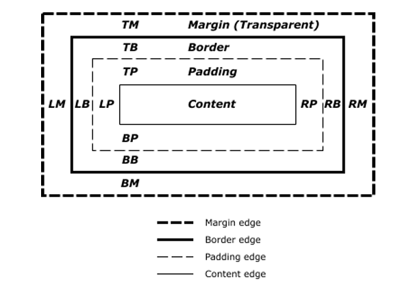

# CSS - Cascade Style Sheet

[<- Home](README.md)

## Box Model 🕙

* We can think about HTML elements as a box
* This concept is known as CSS box model
* The CSS box model is the foundation of layout on the Web as each element is represented as a rectangular box

  

* The box model has 5 parts:
  * **Content area**
  * **Padding area:** refers to the inner margin of a CSS box — between the outer edge of the content box and the inner edge of the border
  * **Border area:** it sits between the outer edge of the padding and the inner edge of the margin
  * **Margin area:** it surrounds a CSS box, and pushes up against other CSS boxes in the layout
  * **Width & height:** this properties set the width and height of the content box, which is the area in which the content of the box is displayed
* [MDN Introduction to the CSS box model](https://developer.mozilla.org/en-US/docs/Web/CSS/CSS_Box_Model/Introduction_to_the_CSS_box_model)
* [MDN Box model](https://developer.mozilla.org/en-US/docs/Learn/CSS/Introduction_to_CSS/Box_model)
* [CSS Tricks - the-css-box-model](https://css-tricks.com/the-css-box-model)

* This properties are added to define the element real width and height value
* **Width** =	width + padding-left + padding-right + border-left + border-right
* **Height** = height + padding-top + padding-bottom + border-top + border-bottom

* Older browsers used to calculate the box model in a different way and this was one of the biggest issues developers had creating layouts
  * [Wikipedia - Internet Explorer box model bug](https://en.wikipedia.org/wiki/Internet_Explorer_box_model_bug)

## Let's Checkout Javascript
* [<- Git](git.md) - [JavaScript ->](javascript.md)