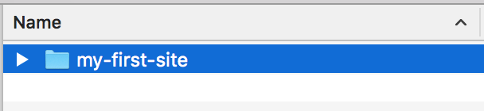
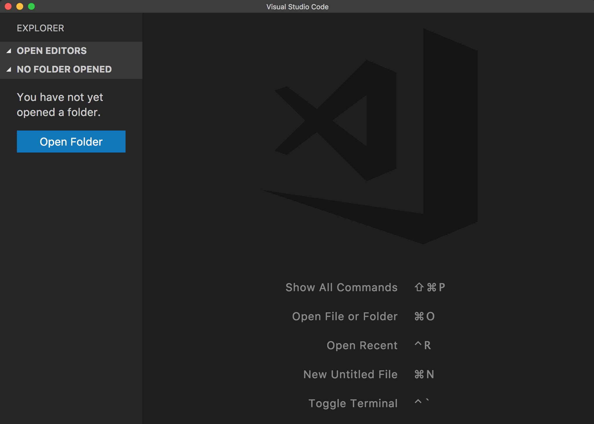
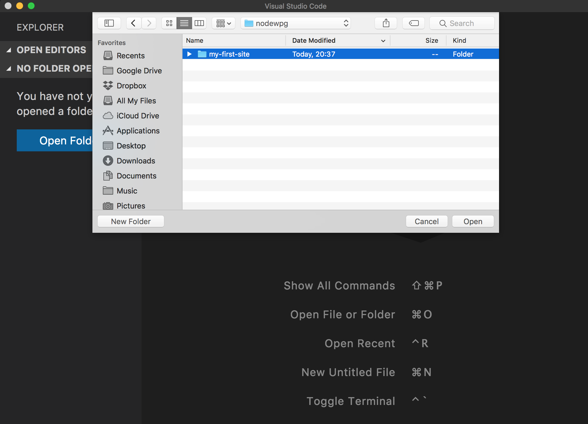
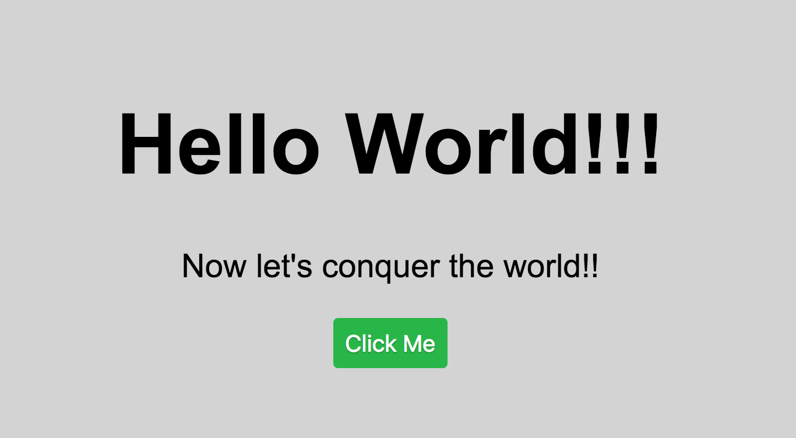

# How does JS work in a web page
[<- Home](README.md)

Follow the next steps to create your first site! These steps are fast pace but follow them and know that __we will review every component of this tutorial__ throughout the course.

## Create a local site

1. Download & install [Visual Studio Code](https://code.visualstudio.com)
2. Create a folder with the name: `my-first-site`

3. Open Visual Studio Code

4. Open my-first-site using Visual Studio Code

5. Create the following files inside the `my-first-site` folder :
  * index.html
  * styles.css
  * script.js

6. Copy and Paste the following code on each document

### index.html
```html
<!DOCTYPE html>
<html lang="en">
<head>
  <title>My First Site</title>
  <link rel="stylesheet" href="style.css">
  <link rel="shortcut icon" href="favicon.ico" type="image/x-icon">
</head>
<body>
  <div>
    <h1>Hello World!</h1>
    <p>Now let's conquer the world!!</p>
    <button>Click Me</button>
  </div>
  <script src="script.js" type="text/javascript"></script>
</body>
</html>
```

### style.css
```css
body {
  background-color: lightgray;
  font-family: Arial;
  text-align: center;
  display: flex;
  align-items: center;
  justify-content: center;
  height: 90vh;
  justify-content: center;
}

h1 {
  font-size: 72px;
}

p {
  font-size: 28px;
}

button {
    color: white;
    font-size: 125%;
    border-radius: 4px;
    border: none;
    text-shadow: 0 1px 1px rgba(0, 0, 0, 0.2);
    background: rgb(28, 184, 65);
    padding: 10px;
    outline: none;
    cursor: pointer;
}

button:hover {
  background: rgb(66, 184, 221);
  padding: 12px;
}
```

### script.js
```js
window.onload = function() {
  const button = document.querySelector('button');

  button.addEventListener('click', function() {
    alert("Let's Rock!!");
  });
}
```

7. (optional, you could create your own) Download the following [favicon.ico](resources/icons/favicon.ico) to my-first-site folder
8. Go to the `my-first-site` folder and double click the file `index.html`
9. You should see a web page like this one:
