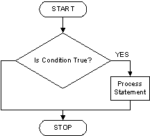
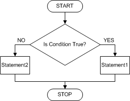

# JavaScript part F (Number and if)

[<- Home](README.md)

## Number methods 

- The Number type allow you to work with numerical values

### parseInt 🕙

- The **parseInt** method parses a string argument and returns an integer of the specified radix or base
- This method returns an integer number parsed from the given string
- If the first character cannot be converted to a number, **NaN** (not a number) is returned
- [MDN parseInt doc](https://developer.mozilla.org/en-US/docs/Web/JavaScript/Reference/Global_Objects/Number/parseInt)

  **Example:**

  ```js
  const numberAsAString = "3";

  console.log(typeof numberAsAString); // string

  const number = parseInt(numberAsAString);

  console.log(number); // 3

  console.log(typeof number); // number
  ```

  **Example:**

  ```js
  const numberAsAString = "3.20";
  const number = parseInt(numberAsAString);

  console.log(number); // 3
  ```

- We can get a **number** from a **string**
- parseInt will return an integer number

### parseFloat 🕙

- The **parseFloat** function parses an argument and returns a floating point number
- This method returns a floating point number parsed from the given value
- If the value cannot be converted to a number, NaN is returned
- [MDN parseFloat doc](https://developer.mozilla.org/en-US/docs/Web/JavaScript/Reference/Global_Objects/parseFloat)
- What happens if you pass in a String representation of an Integer (3) instead of a Float (3.14)?

  **Example:**

  ```js
  const piAsText = "3.14";

  console.log(typeof piAsText); // string

  const pi = parseFloat(piAsText);

  console.log(pi);

  console.log(typeof pi); // number
  ```

### Number toString 🕙

- The **toString** method returns a string representing the specified Number object
- [MDN number toString doc](https://developer.mozilla.org/en-US/docs/Web/JavaScript/Reference/Global_Objects/Number/toString)

  **Example:**

  ```js
  let number = 4;

  console.log(typeof number); // number

  let message = number.toString() + "2";

  console.log(message); // 42

  console.log(typeof message); // string
  ```

- In this example we transfer the number value into a string one
- We use the + operator and instead of adding both values together it will concatenate them as they are both strings
- This is why we need to be careful of which type of value we operate with

#### Practice

[Exercise 48](./exercises/js/ex_48.md)

## Conditionals / Making decisions in your code 

- In any programming language, code needs to make decisions and carry out actions accordingly depending on different inputs
- For example, in a game, if the player's number of lives is 0, then it's game over
- In a weather app, if it is being looked at in the morning, show a sunrise graphic; show stars and a moon if it is nighttime
- Conditional statements allow us to represent this kind of decision making in JavaScript from the choice that must be made, to the resulting outcome of those choices
- [MDN conditionals doc](https://developer.mozilla.org/en-US/docs/Learn/JavaScript/Building_blocks/conditionals)

## If statement 🕙

- The **if** statement executes a statement if a specified condition is **true**
- If the condition is **false**, another statement can be executed
- [if else](https://developer.mozilla.org/en-US/docs/Web/JavaScript/Reference/Statements/if...else)

  

  **Example:**

  ```js
  // Basic if statement structure
  if (condition) {
    // If statement body
    // We'll add the code that we want to execute if the condition is true
  }
  ```

- When coding we need to make decisions based on the conditions that we need
- The if statements will execute this conditions and check whether they are true or false (boolean / true & false values, more about this soon)
- If the statement is true then it will execute the if statement body
- If not, in case the condition is false it will ignore the if statement body and won't execute the code
- Whether the condition it's true or false the code after the if statement it's going to be executed anyway following the natural code flow

  **Example:**

  ```js
  if (true) {
    console.log("Using a if statement with a true condition");
  }
  ```

- In this example we use a **true** boolean value as condition so it's true all the time (its a literal value, no condition here!)
- So we can read this like: `If condition is true then execute the following console.log()`

  **Example:**

  ```js
  const playerLifer = 0;

  if (playerLife == 0) {
    console.log("Game Over!!!!");
  }
  ```

- We can read this statement like: `if the players life is 0 then show a Game Over message`
- It's easy to use **if condition then** phrase to detect that we need a if statement
- Once the if statement has been executed the code flow continues

  **Example:**

  ```js
  const number = 1;

  if (number >= 2) {
    console.log("We won't see this message as the condition it's always false");
  }

  console.log(
    "We will see this massege all the time as it doesn't depend on the if statement and the code flows keeps on going"
  );
  ```

#### Practice

[Exercise 49](./exercises/js/ex_49.md) 🆚 finish this one (if condition)

[Exercise 50](./exercises/js/ex_50.md)

[Exercise 51](./exercises/js/ex_51.md)

## If / else statement  🕙

- Now we know how to use a if statement to check for a given condition but we only care about when it's a true value
- In some cases we need to control also what happens in case the condition is false

  

  **Example:**

  ```js
  if (condition) {
    // if true then it will execute this code
  } else {
    // if not, then it will execute this code
  }
  ```

  ```js
  const number = 5;

  if (number === 2) {
    console.log("The number is 2");
  } else {
    console.log("The number is not 2");
  }
  ```

- We can read this code like: `IF number equals 2 THEN show the number is 2 message ELSE show the number is not 2 message`

#### Practice

[Exercise 52](./exercises/js/ex_52.md) 🆚 HomeWork: finish this one (if condition)

[Exercise 53](./exercises/js/ex_53.md) 

[Exercise 54](./exercises/js/ex_54.md)