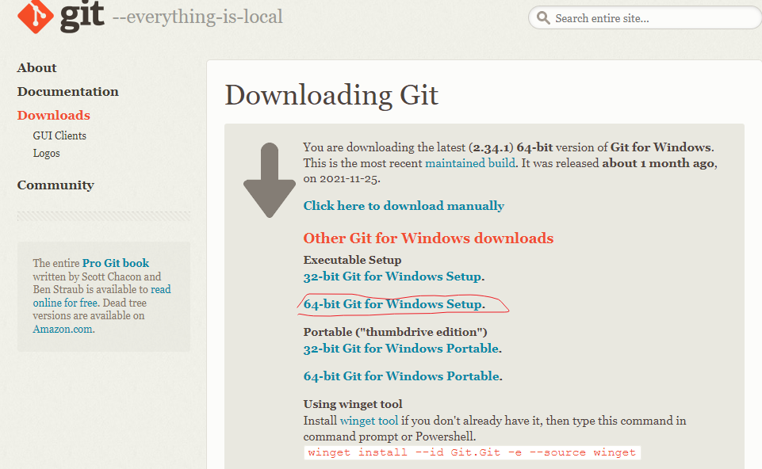

[<- Home](README.md)
# Introduction to Development

## Slack

Joined our slack channel.

## Installing Git (10min)

Git is a version control system that we'll use to save changes and deploy our app. We need to install Git!

1. Visit the URL https://git-scm.com/. 
2. Select your operating system. (Windows 10/11 suggessted)
3. Follow the prompts to install Git!
4. If Git asks you which default editor to use, we recommend Visual Studio Code!

## Visual Studio Code

### Key Advantages of Visual Studio Code 

Visual Studio Code is a simple, code-centric integrated development environment (IDE).

- Available for Mac, Linux, and Windows
- Key features include debugging, version control with Git, and intelligent code completion
- Supports 36 programming languages and offers customized tools and plug-ins to make your dev environment your own!

### Download Visual Studio Code (15min)

1. Go to [Visual Studio Code](https://code.visualstudio.com/)
2. Click the big **"Download for xxx"** button  _If you're having trouble, scroll to the bottom of the page and manually select the correct package for your system_ 

3. Open the VSCode .zip file after it has finished downloading to set up Visual Studio Code. Your browser may let you open the file directly from the download page...  ...or you may have to open your Downloads folder and select the .zip file: 

## What's Web Development?

Refers to all the activities related to building, creating and maintaining websites. It includes aspects such as web design, web publishing, web programming and databases management

### Front End, or Client-Side: (10min)

- Directly user-interactive website parts
- Technologies
  - HTML: Content
  - CSS: Layout
  - Javascript: Interaction

Any website, such as google.ca etc, which can be access by our browsers such as Chrome or Firefox

### Back End, or Server-Side:

- User-hidden functionality.
- Basically any language, but mostly **Node.js**, Python, Go, C#, Ruby etc

_NOTE: Full Stack developer: Someone who is familiar with both kinds of development, and can work on a website from start to finish!_

### Our first line of code in JavaScript in the browser:
The console.log() method outputs a message to the web console. The message may be a single string (with optional substitution values), or it may be any one or more JavaScript objects.
```console.log('hello world')```

https://developer.mozilla.org/en-US/docs/Web/API/console/log

## Next, Let's learn more about the internet

## Questions?

- [<- Home](README.md) - [Internet ->](internet.md)